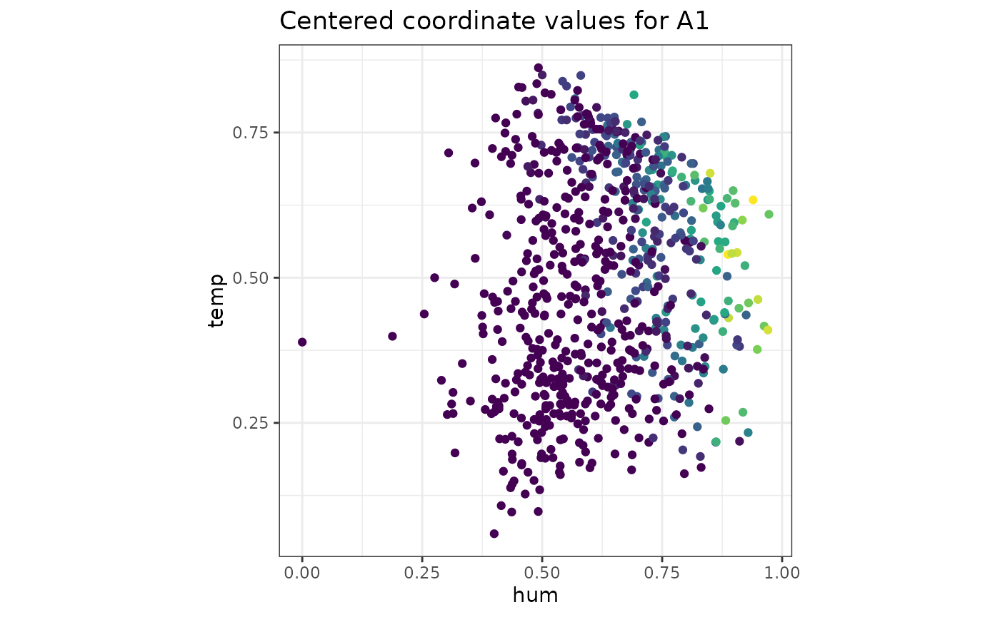
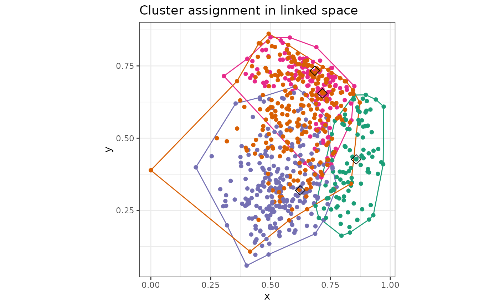

# How to Use makePlots

## Overview

This vignette describes the usage of the
[`makePlots()`](https://gabrielmccoy.github.io/pandemonium/reference/makePlots.md)
function.

`makePlots` is a function to generate the plots as seen in the GUI
outside of it, so they can be saved and shared. Plots that have random
or non deterministic outcomes have a seed set so they can be reproduced.

`makePlots` has got the same inputs as pandemonium (see “Data input for
pandemonium”) with the exception for settings. This replaces the GUI in
the app with one named list to define all settings. Two other small
differences in the input to the function are as follows. `CovInv` is
specified for each space. Coordinate functions cannot be passed as a
named list instead the functions themselves are passed as
`getCoordsSpace1` and `getCoordsSpace2`. `makePlots` also allows for
many of the calculations to be performed once with
[`makeResults()`](https://gabrielmccoy.github.io/pandemonium/reference/makeResults.md)
this allows for the many plots to be made without redoing calculations
everytime see below for more details.

## settings

The named list `settings` has some values that must be specified for
every call to `makePlots` while others are optional or only required for
certain plots. The required values for every call are as follows:

| Settings   | Description                                                                |
|------------|----------------------------------------------------------------------------|
| `k=`       | Numeric, number of clusters                                                |
| `linkage=` | Linkage used by [`stats::hclust`](https://rdrr.io/r/stats/hclust.html)     |
| `metric=`  | Metric used by `getDists`                                                  |
| `plotType` | Plot to create. Each type and their required settings are described below. |

> `linkage` can be one of the following: “complete”, “single”,
> “average”, “median”, “centroid”, “mcquitty”, “ward.D”, “ward.D2”
>
> `metric` can be one of the following: “euclidean”, “maximum”,
> “manhattan”, “canberra”,“binary”, “minkowski”,“user”

### Plot specific settings

Each `plotType` has got its own required settings. For each plot type
these are described as follows:

[TABLE]

The following plotTypes are for high dimension views:

##### “tour”

A `detourr` tour of the high dimensional space.

| Settings        | Description                                                                                                                     |
|-----------------|---------------------------------------------------------------------------------------------------------------------------------|
| `tourspace=`    | One of “space1” or “space2” to show data of in tour                                                                             |
| `colouring=`    | How to colour points in the plot. One of “clustering”, “user”, “bins”, “score”                                                  |
| `user_group=`   | User defined grouping for each point used if “user” is passed for `colouring`                                                   |
| `out_dim=`      | Dimension of output display. Numeric, possible values are 2 or 3                                                                |
| `tour_path=`    | Tour path and type to use, one of “grand”,“cmass”,“holes”,“lda”,“pda”,“dcor”,“origin”,“spline”,“radial”,“mahalanobis”,“anomaly” |
| `display=`      | Display type, one of “scatter”,“slice”                                                                                          |
| `radial_start=` | Projection to use as start of radial tour, one of “random”,“cmass”,“holes”,“lda”,“pda”,“dcor”,“origin”,“spline”,“mahalanobis”   |
| `radial_var=`   | Variable to remove by radial tour                                                                                               |
| `slice_width=`  | Relative slice volume. Numeric                                                                                                  |
| `final_frame`   | if true returns the final frame as a ggplot2 plot of final frame otherwise returns detour object                                |
| `seed`          | Set the seed for the function                                                                                                   |

##### “dimRed”

A dimension reduction view of the high dimensional space.

| Settings       | Description                                                                                   |
|----------------|-----------------------------------------------------------------------------------------------|
| `dimspace=`    | One of “space1” or “space2” to use                                                            |
| `colouring=`   | How to colour points in the plot. One of “clustering”, “user”, “bins”, “score”                |
| `user_group=`  | User defined grouping for each point used if “user” is passed for `colouring`                 |
| `algorithm=`   | Name of algorithm used for dimension reduction                                                |
| `dimReduction` | Function for calculating dimension reduction see “using dimension reduction” for more details |
| `interactive`  | `TRUE` or `FALSE` if true returns plotly plot if false returns ggplot2 plot                   |
| `seed`         | Set the seed for the function                                                                 |

## results

The results parameter allows for faster computation times using the
[`makeResults()`](https://gabrielmccoy.github.io/pandemonium/reference/makeResults.md)
function.

This function creates a list of results used by `makePlots` that are
normally computed if not provided through the results parameter.
`makeResults` takes all of the same parameters as `makePlots`, the
settings that need to be provided are `k`, `linkage` and `metric`. The
output is then passed to `makePlots` and the previous settings no longer
need to be provided.

A typical use is as below.

``` r
r <- makeResults(cluster = Bikes$space1, settings = list(k = 4, metric = "euclidean", linkage = "ward.D2"), cov = cov(Bikes$space1), linked = Bikes$space2, getScore = outsideScore(Bikes$other$res, "Residual"))

makePlots(cluster = Bikes$space1, settings = list(plotType = "Obs", x = "hum", y = "temp", obs = "A1"), cov = cov(Bikes$space1), linked = Bikes$space2, getScore = outsideScore(Bikes$other$res, "Residual"), results = r)
```



``` r
makePlots(cluster = Bikes$space1, settings = list(plotType = "WC", x = "hum", y = "temp", WCa = 0.5, showalpha = TRUE), cov = cov(Bikes$space1), linked = Bikes$space2, getScore = outsideScore(Bikes$other$res, "Residual"), results = r)
```


