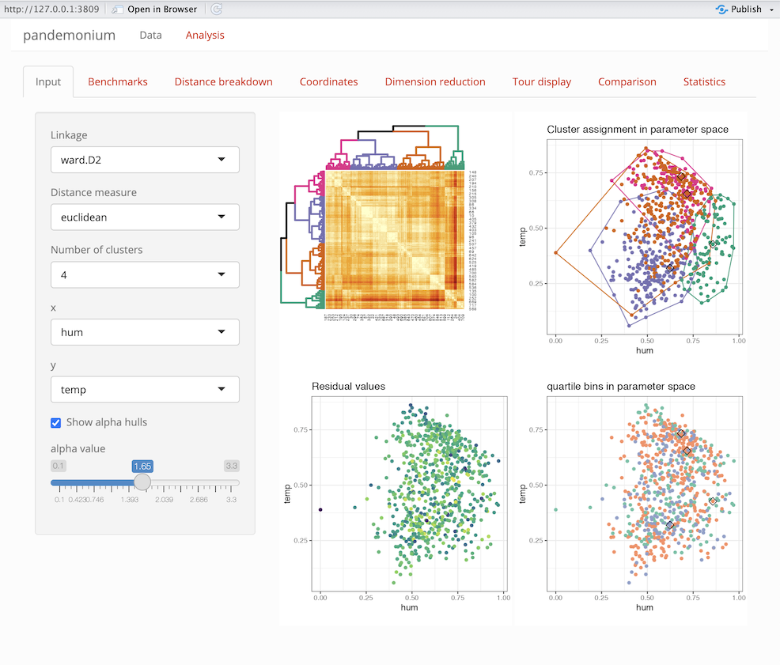
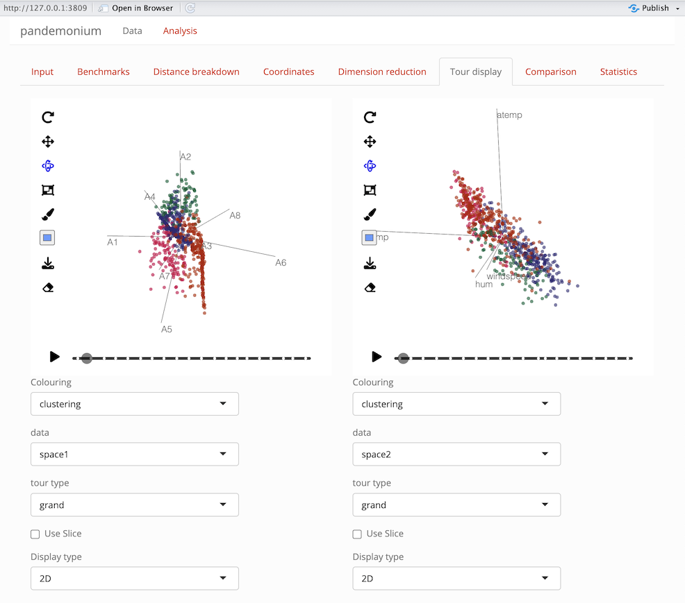

```{r, include = FALSE}
knitr::opts_chunk$set(
  collapse = TRUE,
  comment = "#>",
  out.width = "100%"
)
```

# Overview
This vignette describes the Analysis page of the pandemonium app and each of the tabs on the page. This is to serve as a reference for understanding these pages and the controls and outputs each of them contains.


# Tabs

Once the data is loaded in the data page, the app will open into the analysis page. This consists of tabs that contain different options that can be selected interactively and resulting visualisations.

## Input

```{r,echo=FALSE}

```

This page consists of a side bar with controls and a main panel of outputs.

#### Side bar
|option| Description|
|---------|---------------------------------------------------------------|
| Linkage | This is a setting used by `stats::hclust` to cluster the data |
| Distance measure | This is a metric used by `getDists` to compute distances between points|
| Number of clusters | an integer between 2 and 8 for the number of clusters|
| x,y     | Plot axis from space 2 used in this tab and Coordinates tab |
| show alpha hulls | a check box to show alpha hulls in the clustering plot in this tab|
| alpha value | a numerical value for the alpha used by alpha hulls|

#### Outputs

On the right side of the tab 2-4 plots will be shown depending on the result of getScores.

| | |
|------------------------------------|------------------------------------|
| **Heatmap plot** | **Clustering plot** |
|this is an ordered dendrogram plot of the clustering| This is a plot of the clustering assignment with axes as selected in the side bar. Alpha hulls for each cluster will also be shown if selected|
| **Score values** | **Score Bins** |
| If `getScores` returns scores for each point these will be shown here on the axes selected in the side bar | If `getScores` returns bins for each point these will be shown here on the axes selected in the side bar 


## Benchmarks

```{r,echo=FALSE}
knitr::include_graphics("Images/benchmark_tab_bike.png")
```


This tab will show benchmark information for clusters and user assigned groupings if supplied. The benchmark point of a cluster is defined as the point which has the smallest average squared distance from all other points within the cluster. The first columns of the table will be the linked space values of the benchmark points, then the cluster radius (maximum distance of any point in the cluster from its benchmark) and diameter (maximum distance between any two points within the cluster) will be given. Finally the score value of the benchmark point will be given if getScores returns a score.

## Distance breakdown

```{r,echo=FALSE}

```

This tab is used to compare within and between cluster distances. Two histogram plots are shown for each cluster. The right plot is the within cluster distances (the distances between each pair of points within the cluster) and the left plot is the outside cluster distances (the distances between any point within the cluster and any point outside the cluster). A shadow is shown in the background of the overall distribution of distances in the data set. Both histograms on the plot are normalised such that the area below is 1.

><span style="color: red;">WARNING: Distance breakdown tab can take up to 10 minutes to load. The app may be unresponsive during this time.</span>


## Coordinates

```{r,echo=FALSE}
knitr::include_graphics("Images/coordinates_tab_bike.png")
```

This tab is used to compare the coordinates of the clustering space.
The top output is a colour scaled scatter plot of each variable in the cluster space shown on the x-y axis from the selection on the input page. Here the colour gradient shows high (yellow) to low (blue) values for each variable in space 1.
Below this is a parallel coordinate plot of the variables in space 1. The points are coloured by clustering with benchmark points plotted opaque and all other points slightly transparent. Note that `ggpcp` will break ties on points with the same value for a clearer plot.
Below this plot are 3 settings:

 - Center: centres the coordinates by their mean
 - Scale: scales the coordinates by their standard deviation
 - Filter: filters which clusters to display

## Dimension Reduction

```{r,echo=FALSE}

```

This tab is used to show dimension reduced plots of both the cluster and linked space using the functions given in dimReduction. On this tab two plots are shown, each with options below it for user selection. 

| Option | Description | Note |
|--------|---------------------------------|----------------|
| Algorithm | Method used for dimension reduction | Names of dimReduction list, default: tSNE or UMAP|
| Data | Data used in plot | Choice of either space 1 or space 2 |
| Colour | Colouring of points in the plot | Clustering or scores, bins if calculated by `getScores` or user defined grouping if given in data page|


The dimension reduction plots use `plotly` for their displays this allows for zooming, panning as well as hovering over points. This hover will display the points' coordinates in dimension reduced form as well as the value used for colouring and the point label if provided in the data page.


> The dimension reduction plots and tour displays are linked via crosstalk for linked brushing between them.
> See the section on linked brushing at the bottom of this page for more information on this.

## Tour Display

```{r,echo=FALSE}

```

This tab is used to explore the cluster and linked space through tour displays. Two tours are displayed with options for each which can be selected below. 

| Option | Description | Note |
|--------|---------------------------------|----------------|
| Colour | Colouring of points in the plot | Clustering or scores, bins if calculated by `getScores` or user defined grouping if given in data page|
| Data | Data used in plot | Choice of either space 1 or space 2 or up to 5 principal components from the PCA of each space |
| Tour type | Used to define the tour path | Grand and Radial will define their respective tours, the other choices are projection pursuit indices. Radial, Spline and Anomaly tours are not defined for 3d views. |
| Use slice | Selection to turn view from a regular scatter to slice view | Slice width can be chosen if selected |
| Display type | Selection of 2D or 3D projection | Some choices will be removed for 3D view |
| Radial variable | Choice of variable from data projected to remove from view | Only shown if radial tour type is selected |
| Radial start | Projection to start radial tour from | Random or a projection pursuit index which will be used first |
| Slice width | Relative volume of slice | Only shown if use slice is selected |
| ellc | Ellipse scale for anomaly tour | Only shown if anomaly tour is selected |


## Comparison

```{r,echo=FALSE}

```

This tab is used to compare different options and their effects on clustering. 

#### Options

The following options can be selected for clustering `a` and `b` for comparison.

|option| Description|
|---------|---------------------------------------------------------------|
| Coord | Coordinate function to use on space 1 from the list in getCoords |
| Linkage | This is a setting used by `stats::hclust` to cluster the data |
| Distance measure | This is a metric used by `getDists` to compute distances between points |
| Number of clusters | an integer between 2 and 8 for the number of clusters|
| x,y     | Plot axis from space 2 used in this tab and Coordinates tab |
| show alpha hulls | a check box to show alpha hulls in the clustering plot in this tab|
| alpha value | a numerical value for the alpha used by alpha hulls|


#### Outputs

The same options as the input tab are shown here with two separate choices for each. A check box is also given to select the same options as used in the input tab. If user defined grouping are given in the data page, these can also be selected for comparison, although the heatmap plot will not update for this choice. A heatmap plot and cluster assignment plot are shown for each on the right of the page. Below the settings a contingency table is shown to compare the two cluster assignments.


## Statistics

```{r,echo=FALSE}
knitr::include_graphics("Images/statistics_tab_bike.png")
```

This tab is used to evaluate the number of clusters that should be used. The following cluster statistics are evaluated for solutions with two to eight clusters:

- WB ratio
- Normalized gamma
- Dunn index
- Calinski and Harabasz index
- Minimum radius
- Maximum radius
- Maximum diameter
- Minimum benchmark distance
- ARI with CI binning

# A note on linked brushing

Linked brushing is enabled between the tour displays and dimension reduction displays. To use this select the box or lasso tools in the plotly dimension reduction plots or the box selector tool in the detourr tour display plot. Using these tools, make a selection on the plot and this selection should show between all other plots. If any plot is updated, the selection on this plot will be undone. This will not break the linking and the selection can be reset by double clicking on any of the plots with a selection tool, by pressing the reset button or by making a new selection on a plot. For more information on the other tools available in these plots see detourr and plotly respectively.
