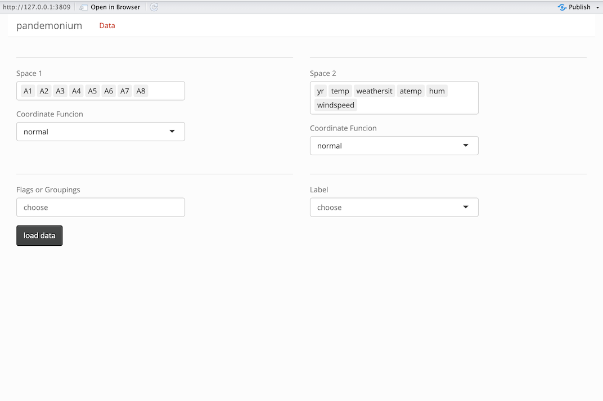

```{r, include = FALSE}
knitr::opts_chunk$set(
  collapse = TRUE,
  comment = "#>",
  out.width = "100%"
)
```

## Inputs
The input for pandemonium is designed for an array of data. Variables are sorted into the clustering space (df) and the linked space (space2). They should be passed to as two separate arrays with the clustering variables in `df = clusteringData` and the linked variables in `space2 = linkedData`. This will select them in space 1 and 2 in the data screen when loading the app. This can be done like this:
```{r,eval=FALSE}
newPandemonium(df = Bikes$space1, space2 = Bikes$space2)
```

### Optional inputs

A complete input for `pandemonium` includes optional data and function inputs. The all inputs are shown in the following call.
```{r,eval=FALSE}
pandemonium(df, cov = NULL, is.inv = FALSE, exp = NULL, space2 = NULL, space2.cov = NULL, 
            space2.exp = NULL, group = NULL, label = NULL, user_dist = NULL, 
            dimReduction = list(tSNE = tSNE, umap = umap), getCoords = list(normal = normCoords), getScore = NULL)
```

#### Data Inputs
| Input      | Type       | Applies to | Default | Purpose     |
|------------|------------|------------|---------|-------------|
| `label`            | vector, length = n  | points     | row index | Shown in tours/dim. reduction hover text |
| `group`            | vector / data.frame | points     | none    | Define user-specified groups; categorical or numeric |
| `cov`,`space2.cov`*| matrix              | group/space | computed via `stats::cov` | Used in `getScores`, `getCoords`, anomaly tour |
| `exp`,`space2.exp` | data frame with column `value` length of number of variables in space| variables | mean vector | Reference point in space used in getCoords |
| `user_dists`       | matrix              | space1     | ignored | Advanced: overrides `getDists` output |

\* `cov` can also be the inverse covariance matrix by setting `is.Inv=TRUE`

#### Function inputs

| Input  | Type |  Use |
|---|--------|---------|
|`getCoords`| named list of coordinate functions | computes coordinates for distance calculations|
|`getScores`| Function that rurns a named list   | computes scores and/or bins for use in plotting|

> See `vignette("getScores")` and `vignette("getCoords")` for more information on these inputs.

## The data page

Once a call to `pandemonium()` is made the app will load into the data page which looks like below.
```{r,echo=FALSE}

```

On this page, variables can be removed from either space or even moved between them. A Coordinate function can be selected from the input functions. There are also two additional inputs for groupings or flags as well as a label.

#### Groupings
In this input you can select and variables passed to pandemonium in the `group=` input, as well as any variables removed from df or space 2 by deleting them in their inputs or variables that were automatically removed for being non-numeric. This is designed for categorical data so that it can be compared to clustering results. The selected variable(s) will be converted into a single factor with `interaction()`.

#### Label

In this input you can select the label passed to pandemonium in the `label=` input, as well as the same removed variables from above. This input is designed to give a unique label for each point so row numbers or unique IDs are recommended.
